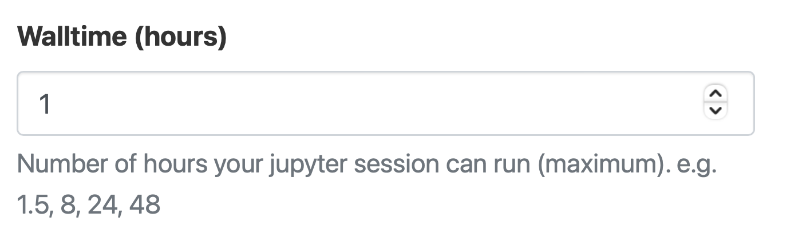
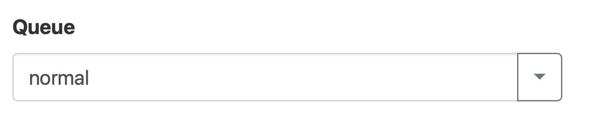
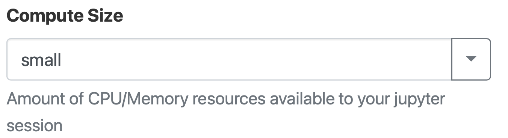
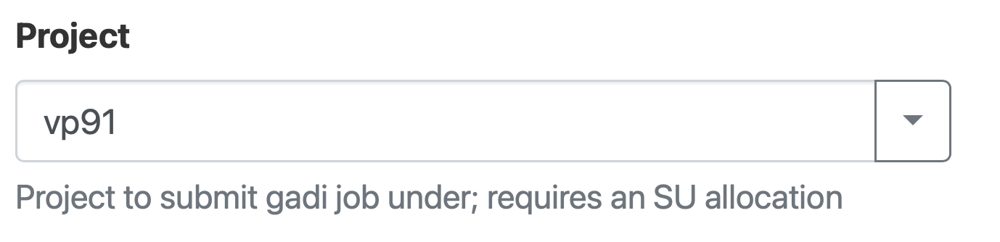
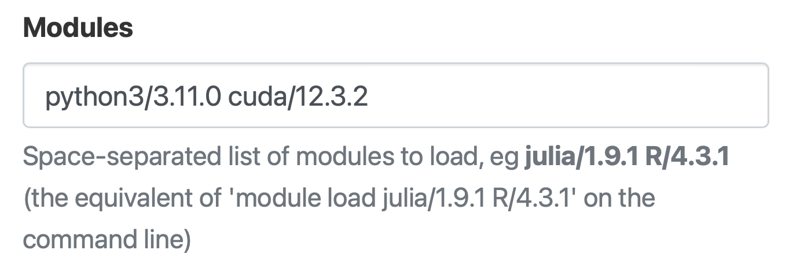
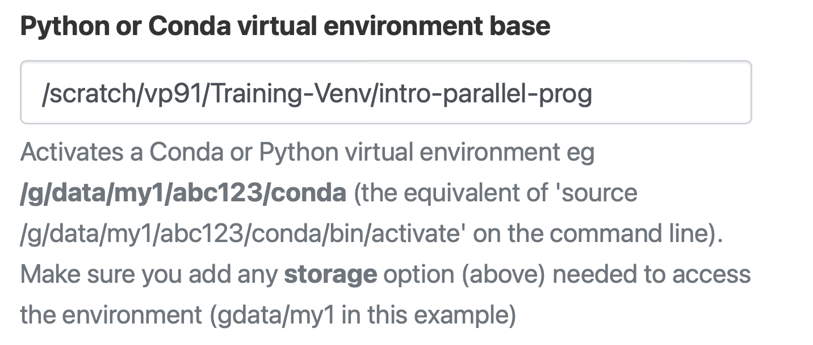
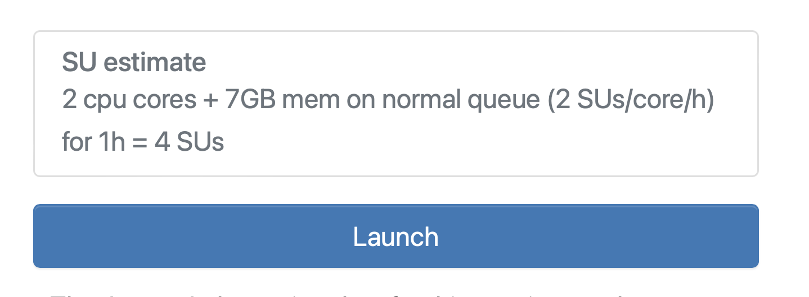
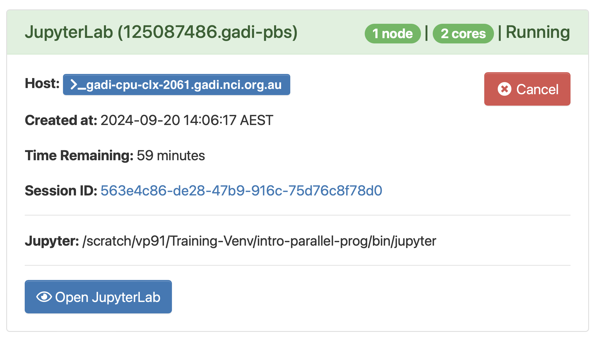
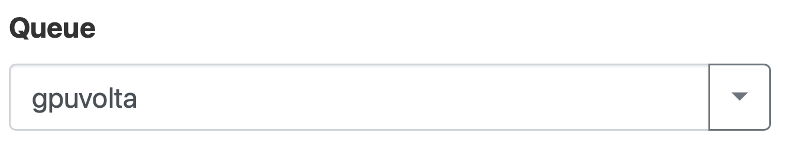
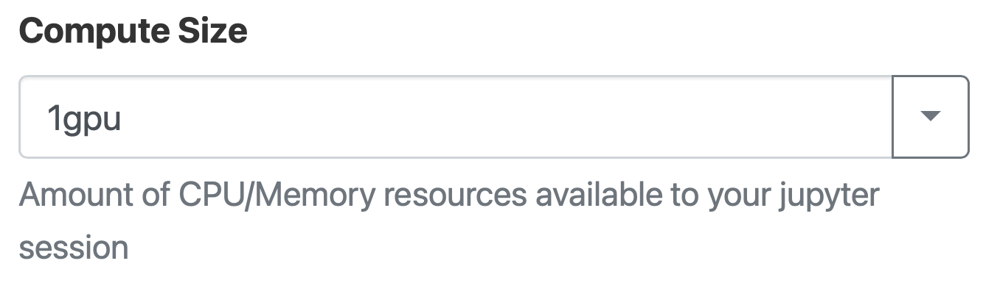

Jupyter notebooks in ARE 
-------------------------------------

.. admonition:: Overview
   :class: Overview

    * **Tutorial:** 30 min

        **Objectives:**
            #. Learn how to use Jupyter notebooks in ARE. 

Specify how many hours you need the Jupyter notebooks for. 

Specify the queue you need.

Specify the size of the compute (cores and memory).

Specify the project you are going to use.

.. image:: ../figs/5.png

Specify the storage folder (not a necessary field).

Specify all the modules you need (for your virtual environment).

Specify the virtual environment you need. 

Launch the Jupyter notebook.

Once the job is granted you can access the Jupyter note by clicking on `Open JupyterLab`.

Requesting GPUs
****************

Use the queue `qpuvolta` for GPUs.

Select the number GPUs you need.

.. admonition:: Key Points
   :class: hint

    #. ARE makes using Jupyter notebooks easy on Gadi.

