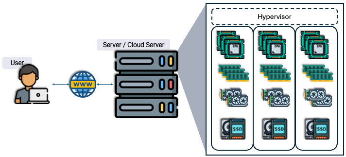
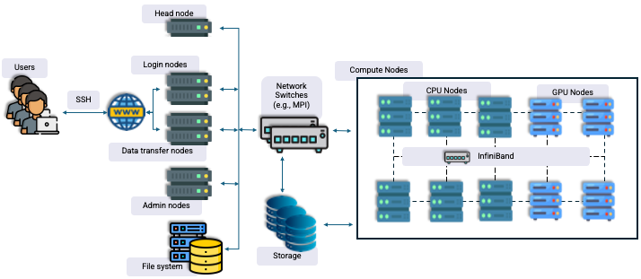
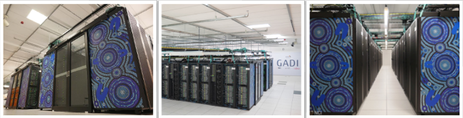
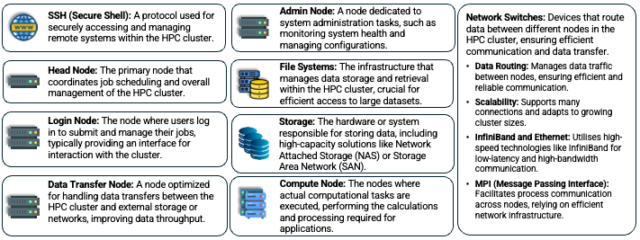
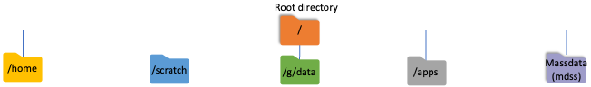

Introduction to HPC, NCI and Gadi
---------------------------------

.. admonition:: Overview
   :class: Overview

    * **Tutorial:** 45 min

        **Objectives:**
            * Learn the general design of an HPC machine.
            * Learn how Gadi is organized.

What is High Performance Computing?
**********************************

High-performance computing (HPC) involves using clusters of powerful processors working in parallel to process large datasets and perform complex 
calculations at extremely high speeds. 

**Why use HPC?**
* ``Running large-scale tasks like cross-validating statistical models multiple times (e.g., 1000+ runs).``
* ``Handling massive data sets, such as genomic sequencing, which would overwhelm local computers.``
* ``Training machine learning algorithms that demand high computational power and memory.``
* ``Performing tasks beyond the capability of standard PCs, including simulations, numerical calculations, and computer modeling.``

Computer architecture
********************************

.. image:: ../figs/arch1.png

Architecture of Desktops/laptops and workstations

Architecture of Servers (Cloud servers)

Architecture of HPC

Gadi servers at NCI.

Components of an HPC
********************

.. image:: ../figs/Hpc2.png

An HPC cluster is made up of hundreds or thousands of compute servers, called nodes, that are networked together to work in parallel, significantly 
increasing processing speed. 

Key features:
- Each node contains multiple processors, ranging from 8 to 64 cores.
- Nodes are connected via a high-speed network, such as InfiniBand.
- The system is typically Linux-based.

Gadi
*****

Gadi is Australia's fastest CPU-based research supercomputer, delivering more than 10 petaflops of peak performance, which equates to over ten quadrillion (10¹⁵) floating point operations per second. 

Key specifications:
- 4997+ compute node servers
- Over 250,000 compute cores (including Intel Sapphire Rapids, Cascade Lake, Skylake, Broadwell, and NVIDIA V100, DGX A100)
- 930 terabytes of memory
- 200 Gb/s InfiniBand HDR network

Gadi debuted as the 24th fastest supercomputer in the world and is currently ranked 62nd.

Gadi File System
********************

**/home:**

- Personal user space
- Backed up regularly
- 10 GiB fixed quota per user
- Ideal for storing important and hard-to-reproduce files

**/scratch:**

- Project space, managed by NCI
- Offers the fastest performance
- Not backed up
- Temporary storage for files
- Files are automatically deleted if not accessed for 100 days
- Best suited for raw experimental output

**/g/data:**

- Permanent disk space
- Managed by a sponsor scheme or institution
- Designed for long-term storage of large data files
- Allows storage of data for use with HPC applications
- Ideal for long-term data, input files, source code, and more

**/apps:**

- Read-only storage
- Owned and managed by NCI
- Hosts centrally installed software applications and modules

**/mdss:**

- Backed-up storage
- Managed by a sponsoring scheme or institution
- Utilizes advanced magnetic tape storage libraries
- Ideal for archiving important files that require infrequent access

Compute Resources
********************

Compute resources are allocated to projects, not individual users, through various allocation schemes.

- Service Units (SU) measure Gadi's compute hours.
- Projects must have a compute allocation to run jobs.
- Compute allocations are assigned quarterly.
- Allocations can be transferred, adjusted, or reallocated by the project's Chief Investigator (CI) or scheme manager.
- Unused allocations can roll over to the next quarter if requested within the first two weeks of the current quarter.

Service Units (SUs) are charged based on the resources reserved for a job and the walltime. The resources reserved are determined by the greater of 
the requested CPUs or the proportion of memory.

**Job Cost (SU) = Queue Charge Rate × Max(NCPUs, Memory Proportion) × Walltime Used (Hours)**

- **Queue Charge Rate**: The charge rate for the queue as listed in the `Queue Limits <https://opus.nci.org.au/pages/viewpage.action?pageId=236881198>`_. Note that using express queues increases job priority but also raises the job's cost.
- **NCPUs**: The number of CPUs requested for the job using the PBS `-l ncpus` option.
- **Memory Proportion**: Calculated as Memory requested ÷ Memory per core (where Memory Per Node is divided by NCPUs per node for the queue).

**Example:** A job using 1 CPU for 30 minutes in a normal queue will incur a charge of 1 SU. 

For example, a job using 4 CPUs with 16 GiB of memory for 5 hours of walltime in a normal queue will be charged 40 SUs:

- Calculation: 4 CPUs × 5 hours × 2 SU per hour = 40 SU.

The situation can become more complex:

- Some jobs may require fewer CPUs but need more memory.
- Others may require GPUs.
- Some jobs might need to use the express queue.