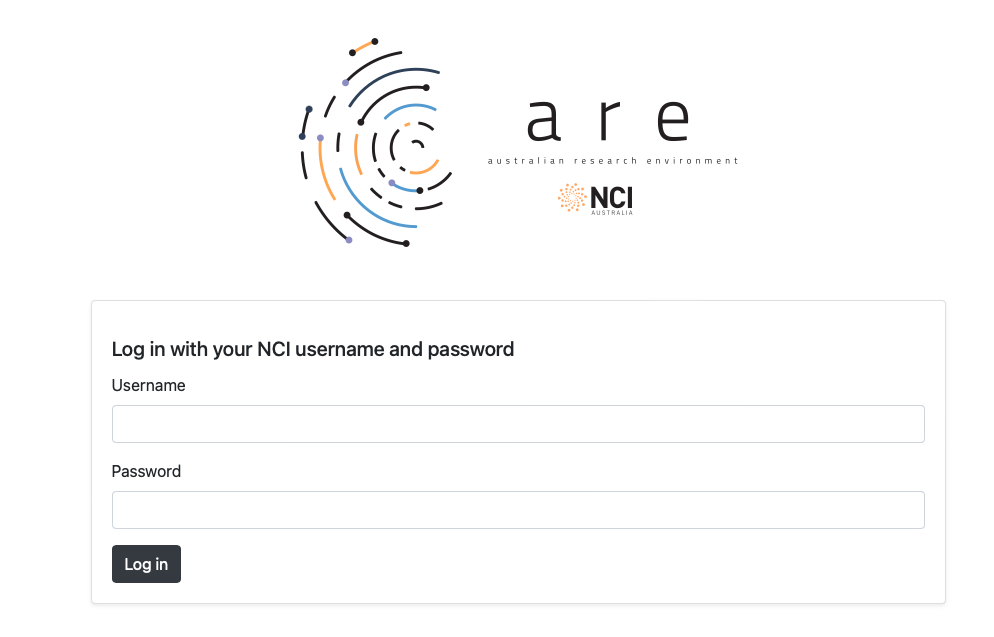
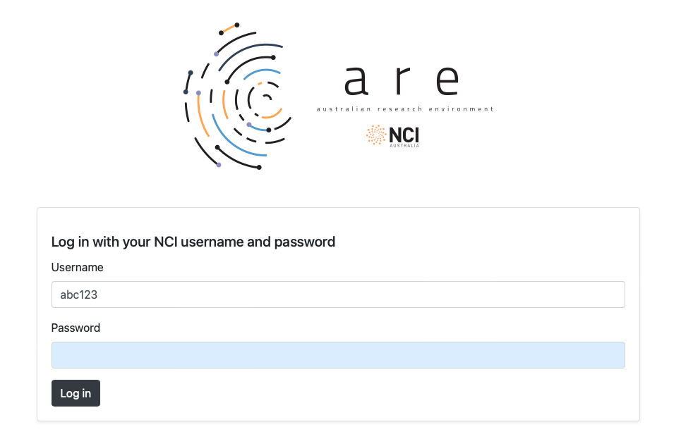

Australian Research Environment (ARE)
-------------------------------------

.. admonition:: Overview
   :class: Overview

    * **Tutorial:** 10 min

        **Objectives:**
            #. Learn how to use Gadi terminal in ARE. 

Us the link - http://are.nci.org.au to login to Australian Research Environment (ARE). 

You should use your NCI username (not your email) and your NCI password to login. 

.. image:: ../figs/14.png

From the landing page select **Gadi Terminal**. 

.. image:: ../figs/15.png

Now you should have access to a terminal on Gadi. 

.. admonition:: Key Points
   :class: hint

    #. ARE makes using terminal easy on Gadi.

